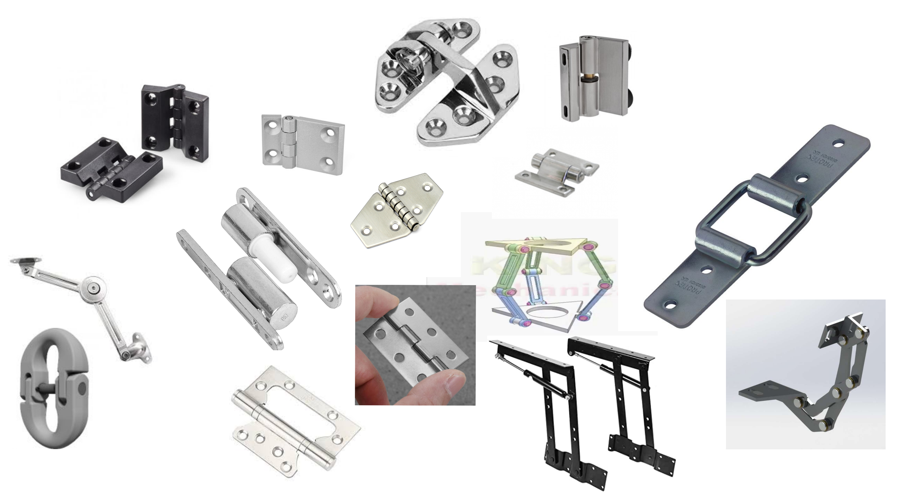

# Mechanismen modellieren 

## Aufgabe 

Schnapp dir ein Objekt mit einem mechanischem Gelenk und modelliere es. 
Achte dabei vor allem darauf, wie du das Modell aufbaust und welche Abhängigkeiten du setzt. 
Wichtig ist der Allgemeine Aufbau des Objektes, du musst nicht auf millimetrangaben achten.  
Das Objekt sollte deinen Fähigkeiten entsprechen (Wenn du bereits viel Erfahrung in Fusion hast kannst du ein komplexeres Objekt nutzen)

Falls du kein Passendes Objekt in deiner Nähe hast, suche im Internet nach Inspiration. Folgende Suchbegriffe geben gute Ergebnisse: 
- Scharnier
- Hinge 
- Motion Link 
- Mechanical Link 
- Mechanism 

Komplexe Mechanismen findest du auch auf [507movements.com](http://507movements.com/index10.html)

Hier noch ein paar möglich Beispiele: 

